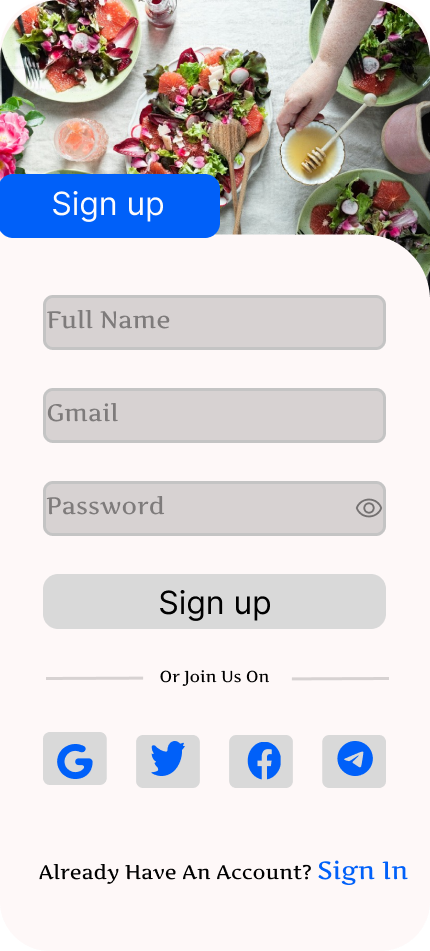
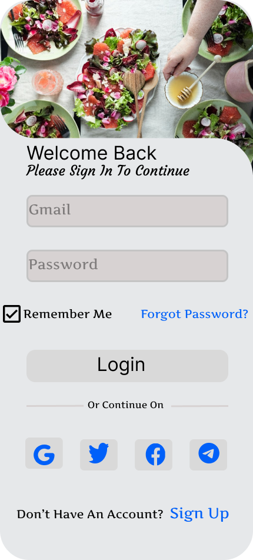

# Signup UI/UX Design

The Signup UI/UX Design project aims to create an intuitive and visually appealing signup interface for web and mobile applications.

---

## Table of Contents

- [Preview](#preview)
- [Features](#features)
- [Design Screens](#design-screens)
- [Contributing](#contributing)
- [License](#license)

---

## Features

- **User-friendly Interface**: Intuitive design to guide users through the signup process smoothly.
- **Responsive Design**: Optimized for various screen sizes to ensure consistency across different devices.

---

## Design Screens

### 1. Signup Form

### 2. Confirmation Screen

---

## Design Vies

- [Figma Design](https://www.figma.com/file/zss3e3iEAV3dVqRbS0E99d/CodSoft-SignUp?type=design&node-id=31%3A2&mode=design&t=lH3QtWEurI1ugkqu-1): View the design on Figma.

---

## Contributing

Contributions are welcome! If you have any suggestions or improvements for the Signup UI/UX design, feel free to:

1. Fork the repository
2. Make your changes
3. Submit a pull request

For major design changes, please open an issue first to discuss your ideas.

---

## License

This project is licensed under the [MIT License](https://opensource.org/licenses/MIT).

---

## Support

For support or inquiries, contact [your contact information] or open an issue on GitHub.
